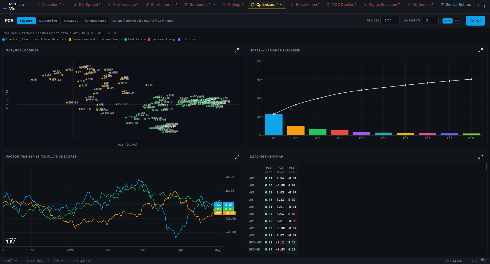

# reit-viz

REIT analysis & visualization app — a Vite/React client + Express (TypeScript, tsx) server
with better-sqlite3 + drizzle-orm. The entire application lives in **`reit-viz/`**.

## Run locally (Docker)

```bash
docker build -t reit-viz ./reit-viz
docker run -d --name reit-viz -p 5000:5000 reit-viz
# open http://localhost:5000
```

Upload your REIT workbook from the in-app **Data Management** UI to populate ticker data
(the server stores it under `reit-viz/data/`).

## PCA analysis

The **PCA** page (top nav → *Optimizers* → *PCA*, or `/#/pca`) runs principal-component
analysis over the filtered universe. Four modes: **Factors** (latent factors in daily
returns, PC1 ≈ market), **Clustering** (peer groups that co-move), **Residual** (factor
model → idiosyncratic mean-reversion candidates), and **Fundamentals** (PCA over a
valuation/growth/yield snapshot). Click the **?** by the title for an in-app guide.



### Resync ticker data from the live Vultr backend

Fresh local containers have no per-ticker price files, so charts 404. Instead of
re-uploading the workbook, pull the data straight from production:

```bash
npm run pull-data --prefix reit-viz
# or: node reit-viz/scripts/pull-vultr-data.mjs
```

It fetches all tickers over Vultr's HTTP API, re-encodes them into the on-disk
format (round-trips losslessly — verified sha256-identical to Vultr), and
`docker cp`s them into the local container's data volume. Re-run it any time prod
data drifts. Overrides via env: `VULTR_BASE`, `CONTAINER` (default `reit-viz`),
`LIMIT`, `CONC`; pass `--no-load` to stage files without loading.

## Run locally (dev)

```bash
cd reit-viz
npm ci
npm run build      # vite client -> dist/public, esbuild server -> dist/index.cjs
NODE_ENV=production node dist/index.cjs
```

## Deploy to Vultr (GitHub Actions)

Two manual workflows (Actions tab). Both need the `VULTR_SSH_PASSWORD` repo secret.

- **Deploy reit-viz to Vultr** — client-only (`dist/public`). Use for routine frontend changes.
  Run with the `deploy` box checked (unchecked = build-only dry run).
- **Deploy reit-viz FULL (server + client) to Vultr** — ships the server too; backs up the
  live install first and rolls back on failure. Type `DEPLOY-FULL` to confirm. Use only when
  you've changed server code (`reit-viz/server`).

Optional repo variables override the defaults: `VULTR_HOST` (45.63.20.126), `VULTR_USER`
(root), `VULTR_PATH` / `VULTR_DIR` (/opt/reit-viz), `PM2_APP` (reit-viz).

### Server-side config (NOT version-controlled — restore manually after a rebuild)

The deploy only ships the app bundle (`dist/`). The reverse proxy that fronts it lives on
the Vultr box under `/etc/nginx/` and is **not** in this repo — so the settings below must be
re-applied by hand if the server is ever rebuilt.

`nginx` (1.22.1) terminates TLS on `:443` and proxies to the pm2-managed Express server; it
then serves `dist/public` assets. There are ~167 lazily-loaded JS chunks, so **HTTP/2 is
enabled** on the TLS listener to multiplex them over one connection (HTTP/1.1 caps a browser
at ~6 connections per origin). On nginx 1.22 this is the `http2` parameter on the `listen`
line — `listen 443 ssl http2;` (the standalone `http2 on;` directive only exists in 1.25.1+):

```bash
# as root on the server — inspect, back up, patch, test, reload
CONF=$(grep -rlE 'listen[^;]*\bssl\b' /etc/nginx/ | head -1)
cp -a "$CONF" "$CONF.bak.$(date +%Y%m%d-%H%M%S)"
sed -i -E '/listen[^;]*\bssl\b/{ /\bhttp2\b/! s/(\bssl\b)/\1 http2/ }' "$CONF"   # idempotent
nginx -t && systemctl reload nginx        # if -t fails, restore the .bak and reload

# verify h2 is negotiated (ALPN):
openssl s_client -connect 45.63.20.126:443 -alpn h2 </dev/null 2>/dev/null | grep ALPN
# → ALPN protocol: h2
```

## Layout

```
reit-viz/            the app (client/ + server/ + shared/)
.github/workflows/   deploy pipelines
```

> History note: this repo previously held disaster-recovery artifacts (the recovered
> production bundle + a stale source tree) used to rebuild the app. Those were removed once
> the reconstruction reached parity; they remain retrievable via the `recovery-artifacts`
> git tag and in history.
